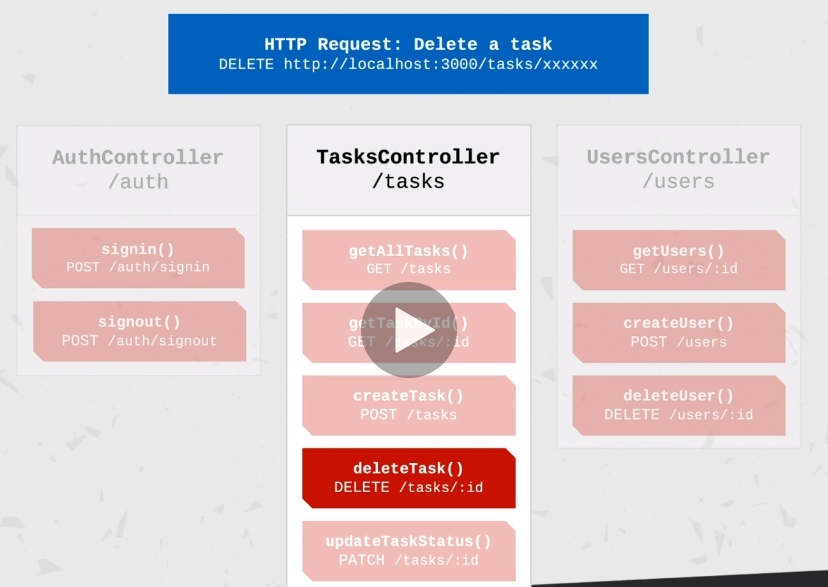

<p align="center">
  <a href="http://nestjs.com/" target="blank"></a>
</p>

[travis-image]: https://api.travis-ci.org/nestjs/nest.svg?branch=master
[travis-url]: https://travis-ci.org/nestjs/nest
[linux-image]: https://img.shields.io/travis/nestjs/nest/master.svg?label=linux
[linux-url]: https://travis-ci.org/nestjs/nest
  
  <p align="center">A progressive <a href="http://nodejs.org" target="blank">Node.js</a> framework for building efficient and scalable server-side applications, heavily inspired by <a href="https://angular.io" target="blank">Angular</a>.</p>
    <p align="center">
<a href="https://www.npmjs.com/~nestjscore"></a>
<a href="https://www.npmjs.com/~nestjscore"></a>
<a href="https://www.npmjs.com/~nestjscore"></a>
<a href="https://travis-ci.org/nestjs/nest"></a>
<a href="https://travis-ci.org/nestjs/nest"></a>
<a href="https://coveralls.io/github/nestjs/nest?branch=master"></a>
<a href="https://gitter.im/nestjs/nestjs?utm_source=badge&utm_medium=badge&utm_campaign=pr-badge&utm_content=body_badge"></a>
<a href="https://opencollective.com/nest#backer"></a>
<a href="https://opencollective.com/nest#sponsor"></a>
  <a href="https://paypal.me/kamilmysliwiec"></a>
  <a href="https://twitter.com/nestframework"></a>
</p>
  <!--[](https://opencollective.com/nest#backer)
  [](https://opencollective.com/nest#sponsor)-->

## Description

Notes taken by Bob Bass - [716green](https://github.com/716green)

Following udemy class by Ariel Weinberger "NestJS - From Zero to Hero"

#### Leftoff:
[Feature: Creating a Task (Part 2: Controller)](https://www.udemy.com/course/nestjs-zero-to-hero/learn/lecture/14744772#overview)

---

[Nest](https://github.com/nestjs/nest) framework TypeScript starter repository.

## Installation

```bash
$ npm install
```

## Running the app

```bash
# development
$ npm run start

# watch mode
$ npm run start:dev

# production mode
$ npm run start:prod
```

## Snippets

```bash
# Generate module
nest g module <module-name>
```

## Test

```bash
# unit tests
$ npm run test

# e2e tests
$ npm run test:e2e

# test coverage
$ npm run test:cov
```
---
### Technologies

#### NestJS
* Modules
* Controllers
* Services and Providers
* Controller-to-Service Communication
* Validation using NestJS Pipes
* Production-ready REST APIs
* Error Handling
* System Modularity
* Back-end Best Practices
* Configuration Management
* Logging
* Security

#### Database
* Postgres
* TypeORM
* QueryBuilder
* Database Performance
* CRUD Operations (Create, Read, Update, Delete)
* Data Transfer Objects (DTO)


#### Security
* Sign up/Sign in
* Authentication and Authorization
* Protected Resources
* Ownership of tasks by users
* JWT (JSON Web Tokens)
* Password hashing, salts, storing passwords in database with crypto libraries

#### Deployment
* Polishing for production
* Deploying to AWS S3

---
## Modules
```bash
# Nest Generate Module
nest g module <module-name>
```
---

## Controllers
```bash
# Nest Generate Controller
# -- spec creates spec file for unit tests
nest g controller <controller-name> --no-spec
```

* Responsible for handling incoming **requests** and returning **responses** to the client.
* Bound to a specific **path** (ex. "/tasks")
* Contain **handlers** which handle **endpoints** and **request methods** (GET, POST, DELETE, etc.).
* Can use **dependency injection** to consume providers within the same module.

#### Defining a Controller
Controllers are defined by decorating a class with the ```@Controller``` decorator. It accepts a string which is the **path** to be handeled by the controller.

```typescript
@Controller('/tasks')
export class TasksController {
  // ...
}
```
Handlers are methods within the controller class, decorated with decorators such as **@Get**, **@Post**, **@Delete**, etc.

```typescript
@Controller('/tasks')
export class TasksController {
  @Get()
  getAllTasks() {
    // do something
    return //...
  }

  @Post()
  createTask() {
    // do something
    return //...
  }
}
```
#### Flow of data/processes
```
Inbound HTTP Request
```
🔽
```
Request => Controller
Handler is called with arguments

NestJS will parse the relevent request data abd it will be available in the handler
```
🔽
```
Handler handles the request
Performs operations such as communication with the service
Ex. Retreiving item from database
```
🔽
```
Response can be of any type and even an exception
Nest will wrap the returned value as an HTTP response and return it to the client
```



---
# Providers
* Can be injected into constructors if decorated as ```@Injectable```, via **dependency injection**.
* Can be a plain value, a class, sync/async factory, etc.
* Providers must be provided to a module for them to be usable.

#### Services

```bash
# Nest Generate Service <folder-to-search-for>
# -- spec creates spec file for unit tests
# Creates a plain TS class with @injectable decorator
nest g service tasks --no-spec
```

* Defined as providers. **Not all providers are services**.
* Common concept in development and are not exclusive to this language or framework.
* Singleton when wtapped with ```@Injectable``` and provided to a module. That means, the same instance will be shared across the application acting as a single source of truth.
* The main source of business logic. Fr example, a service will be called from a controller to validate data, create an item in the database and return a response.


#### Providers in Modules

```typescript
import {TasksController} from './tasks.controller';
import {TasksService} from './tasks.service';
import {LoggerService} from '../shared/logger.service';

@Module({
  controllers: [
    TasksController
  ],
  providers: [
    TasksService,
    LoggerService
  ]
})
export class TasksModule{}

```

#### Dependency Injection
Any component within the NestJS ecosyste can inject a provider that is decorated with the ```@Injectable```

```typescript
import {TasksService} from './tasks.service';

@Controller('/tasks')
export class TasksController {
  constructor(private tasksService: TasksService) {}

  @Get()
  async getAllTasks() {
    return await this.tasksService.getAllTasks();
  }
}

```


---
# Endpoints

| Endpoint          	| Method	| Description                   	|
|-------------------	|--------	|-------------------------------	|
| /tasks            	| GET    	| Get tasks (including filters) 	|
| /tasks/:id        	| GET    	| Get a task                    	|
| /tasks            	| POST   	| Create a task                 	|
| /tasks/:id        	| DELETE 	| Delte a task                  	|
| /tasks/:id/status 	| PATCH  	| Update task status            	|

| Endpoint          	| Method	| Description                   	|
|-------------------  |-------- |-------------------------------  |
| /auth/signup        | POST    | Sign up                         |
| /auth/signin        | POST    | Sign in                         |